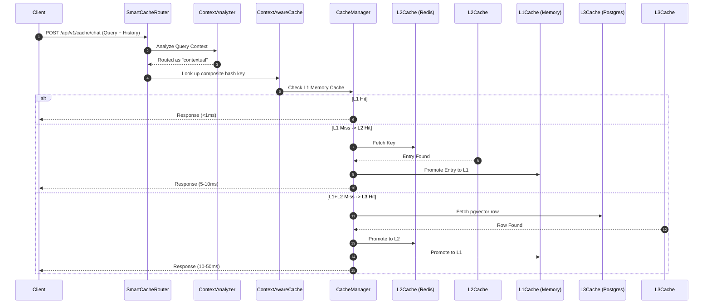
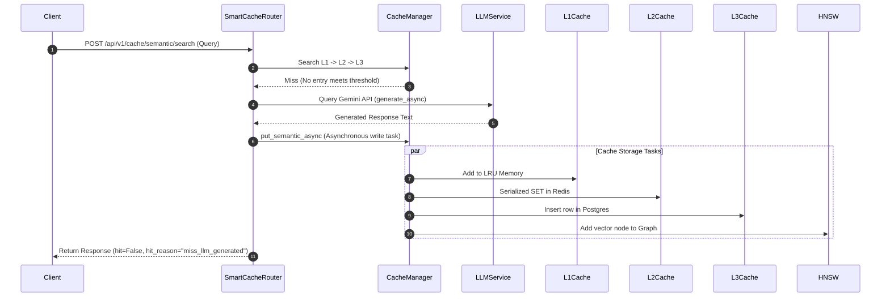

# System Architecture & Design

This document details the high-level system architecture, component breakdowns, data flows, and design decisions of the Semantic Caching Layer.

---

## 🗺️ System Overview

The Semantic Caching Layer is a production-ready middleware that sits between conversational or RAG client applications and downstream Large Language Models (LLMs) and vector databases. It optimizes cost, token usage, and speed through a 3-tier similarity-aware caching strategy.

```
┌────────────────────────────────────────────────────────────────┐
│                       Client Applications                      │
│             (Next.js Chat Client, RAG systems)                 │
└───────────────────────────────┬────────────────────────────────┘
                                │ HTTP POST (/chat, /search)
                                ▼
┌────────────────────────────────────────────────────────────────┐
│                   Semantic Cache Middleware                    │
│                                                                │
│   ┌────────────────────────────────────────────────────────┐   │
│   │                  SmartCacheRouter                      │   │
│   │  Routes query based on conversational context          │   │
│   └───────────────────────┬────────────────────────┬───────┘   │
│                           │                        │           │
│                           ▼                        ▼           │
│             ┌─────────────────────────┐  ┌──────────────────┐  │
│             │   Context-Aware Cache   │  │  Semantic Cache  │  │
│             │ (Conversational Context)│  │   (Stateless)    │  │
│             └─────────────────────────┘  └────────┬─────────┘  │
│                                                   │            │
│                                                   ▼            │
│   ┌────────────────────────────────────────────────────────┐   │
│   │                 3-Tier Caching System                  │   │
│   │                                                        │   │
│   │  ┌──────────────────────────────────────────────────┐  │   │
│   │  │ L1: In-Memory LRU/LFU (with HNSW Index)    <1ms  │  │   │
│   │  └────────────────────────┬─────────────────────────┘  │   │
│   │                           ▼                            │   │
│   │  ┌──────────────────────────────────────────────────┐  │   │
│   │  │ L2: Distributed Redis Cache               5-10ms  │  │   │
│   │  └────────────────────────┬─────────────────────────┘  │   │
│   │                           ▼                            │   │
│   │  ┌──────────────────────────────────────────────────┐  │   │
│   │  │ L3: Persistent PostgreSQL + pgvector     10-50ms  │  │   │
│   │  └──────────────────────────────────────────────────┘  │   │
│   └────────────────────────────────────────────────────────┘   │
│                                                                │
└───────────────────────────────┬────────────────────────────────┘
                                │ Cache Miss (Auto-Fallback)
                                ▼
┌────────────────────────────────────────────────────────────────┐
│                       Backend Services                         │
│                                                                │
│   ┌────────────────────────────────────────────────────────┐   │
│   │                      LLM Service                       │   │
│   │   - Gemini REST Integration                            │   │
│   │   - OpenAI Modular Driver (Stubs)                      │   │
│   └────────────────────────────────────────────────────────┘   │
└────────────────────────────────────────────────────────────────┘
```

---

## 🧩 Component Breakdown

### 1. SmartCacheRouter & Context routing
- **Path:** `src/cache/context.py`
- **ContextAnalyzer:** Classifies incoming queries as `STATELESS`, `CONTEXTUAL`, or `AMBIGUOUS` based on pronouns, referring phrases, and historical turns.
- **SmartCacheRouter:** Routes `STATELESS` queries directly to the unified semantic cache. Routes `CONTEXTUAL` queries to the `ContextAwareCache`, generating composite search keys utilizing a hash of the query text blended with session histories (`X-Conversation-History`).

### 2. The 3-Tier Cache Manager
- **Path:** `src/cache/cache_manager.py` — Orchestrates data flows and promotions between storage tiers:
  - **L1 (In-Memory, `src/cache/l1_cache.py`):** Lightning-fast LRU/LFU storage using Python dictionaries. Retrieves values in `<1ms`. Holds the hot, most-frequently accessed entries.
  - **L2 (Redis Warm Cache, `src/cache/l2_cache.py`):** Distributed Redis cache store. Retains entries in serialized JSON or compressed formats. Promotes values to L1 on cache hits. Latency is `5-10ms`.
  - **L3 (PostgreSQL Cold Storage, `src/cache/l3_cache.py`):** Persistent relational storage backed by `PostgreSQL` and vectorized index search (`pgvector`). Serves as the ultimate source of truth. Promotes values to L2 and L1 on hit. Latency is `10-50ms`.

### 3. Sentence-Embedding & Similarity Search
- **Embedding Service (`src/embedding/`):** Generates 384-dimensional dense vector embeddings of normalized query texts using the local `sentence-transformers` library.
- **HNSW Index (`src/similarity/`):** A Hierarchical Navigable Small World (HNSW) graph representing query embeddings, enabling sub-millisecond Approximate Nearest Neighbor (ANN) matches.

### 4. Modular LLM Service
- **Path:** `src/llm/service.py`
- Implements a unified interface (`LLMService`) that automatically resolves cache misses:
  - **Gemini Provider:** Call Google Generative Language API via standard REST requests and Server-Sent Events (SSE) token streaming.
  - **OpenAI Provider:** Pluggable placeholder stubs for custom GPT-4 integrations.

---

## 🔄 Sequence Flows

### 1. Unified Cache Query (Hit Flow)



### 2. Cache Miss & LLM Fallback (Write Flow)



---

## 🎨 Premium Visual Integrations

### Next.js Web Analytics Dashboard
- Visualizes real-time metrics pushed from `/ws/realtime` via persistent WebSockets.
- Includes animated charts (Recharts) detailing L1/L2/L3 hit splits, latency graphs, and total dollar-cost savings.

### Next.js Consumer Chat Application
- Provides a direct sandbox interface calling the `/api/v1/cache/chat` endpoint.
- Attaches persistent UUID conversational identifiers (`X-Conversation-Id`) and manages state arrays (`X-Conversation-History`) to visually verify contextual cache badging and latency gains.
